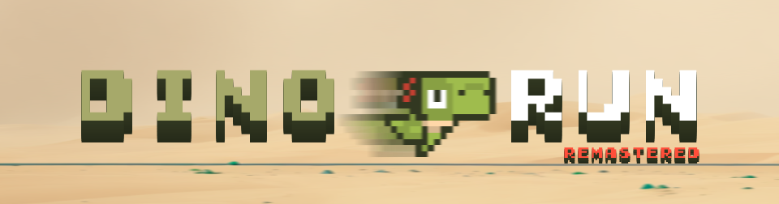

# Dino Run: Remastered - Colorful Chrome Dinosaur Endless Runner Game

**Dino Run: Remastered** is a colorful version of the classic Chrome Dino game, built on Godot 4 using Finite State Machine(FSM) architecture for efficient game state management. Experience the classic endless runner with updated graphics.
 
[Click here to play the game on itch.io](https://floating-echoes.itch.io/dino-run-remastered)



## Gameplay

- Avoid obstacles by jumping over or ducking under them.
- Compete for the highest score!

## Keyboard

- Jump: SpaceBar or Click to make the dino jump
- Sneak/Ducking: Down Arrow to make the dino duck

## Getting Started
To run the game locally, you'll need to have the Godot game engine installed on your system. You can download it from [the official Godot website](https://godotengine.org/download).

1. Clone the repository:

```bash
git clone https://github.com/faisal-askani/Dino_Remastered.git
```

2. Open the project in Godot:
- Launch the Godot engine.
- Click on "Import" and select the `project.godot` file in the cloned repository or Follow the Godot documentation for importing project.

3. Run the game:
- In the Godot editor, click the "Play" button to run the game.
- Alternatively, you can export the game to your desired platform using Godot's export features.

## License

This project is licensed under the [Personal Use Only](LICENSE).
